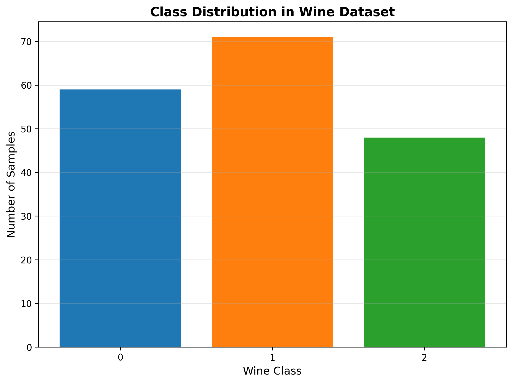
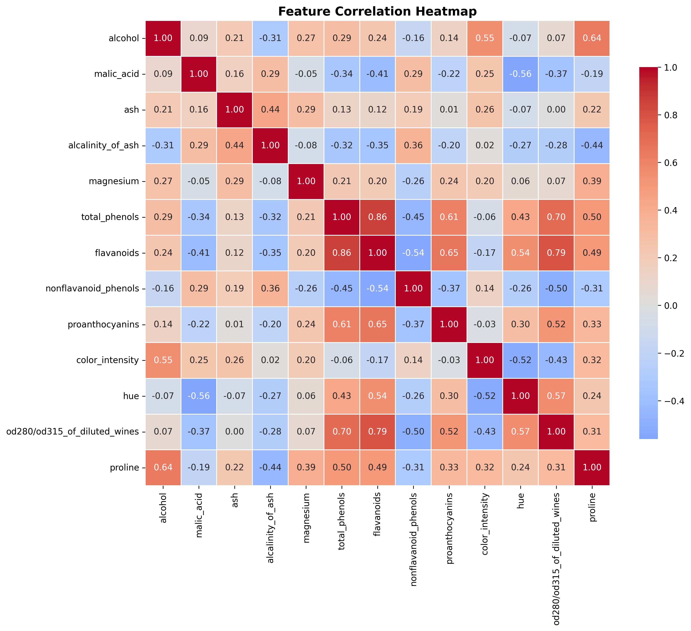
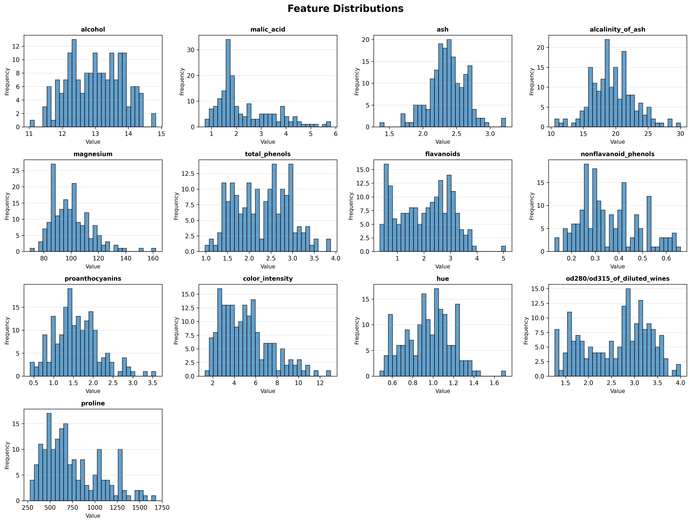
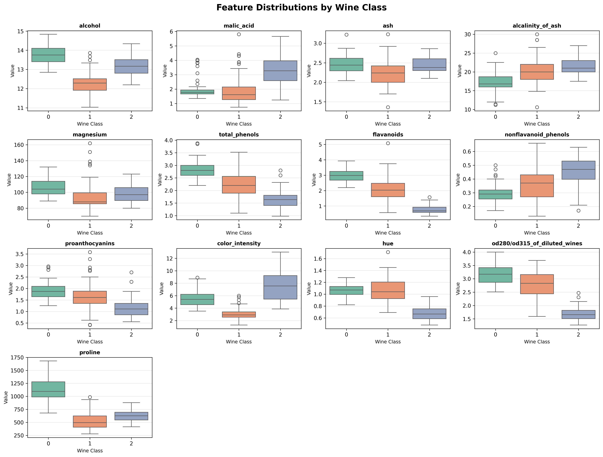
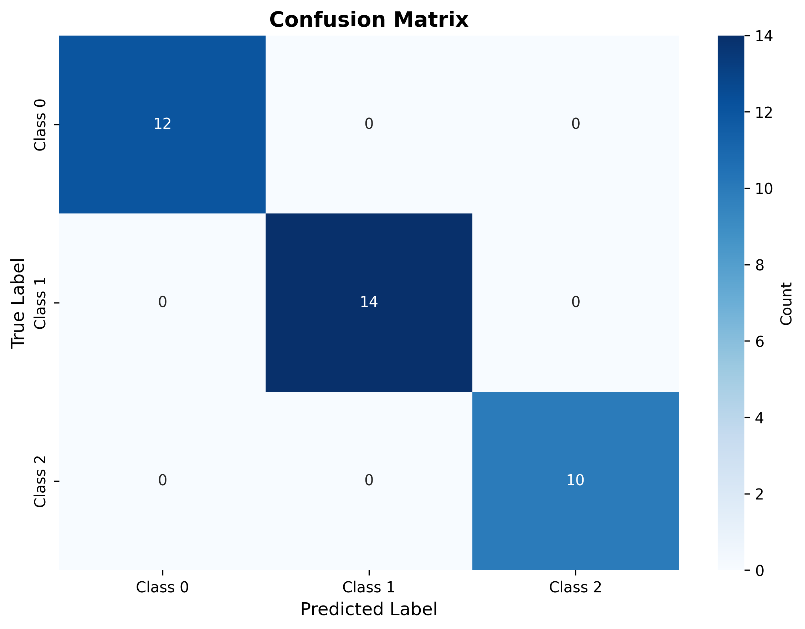
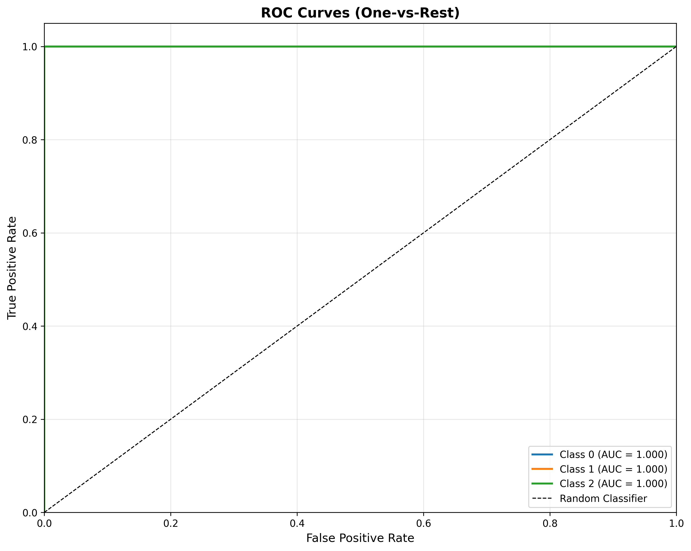
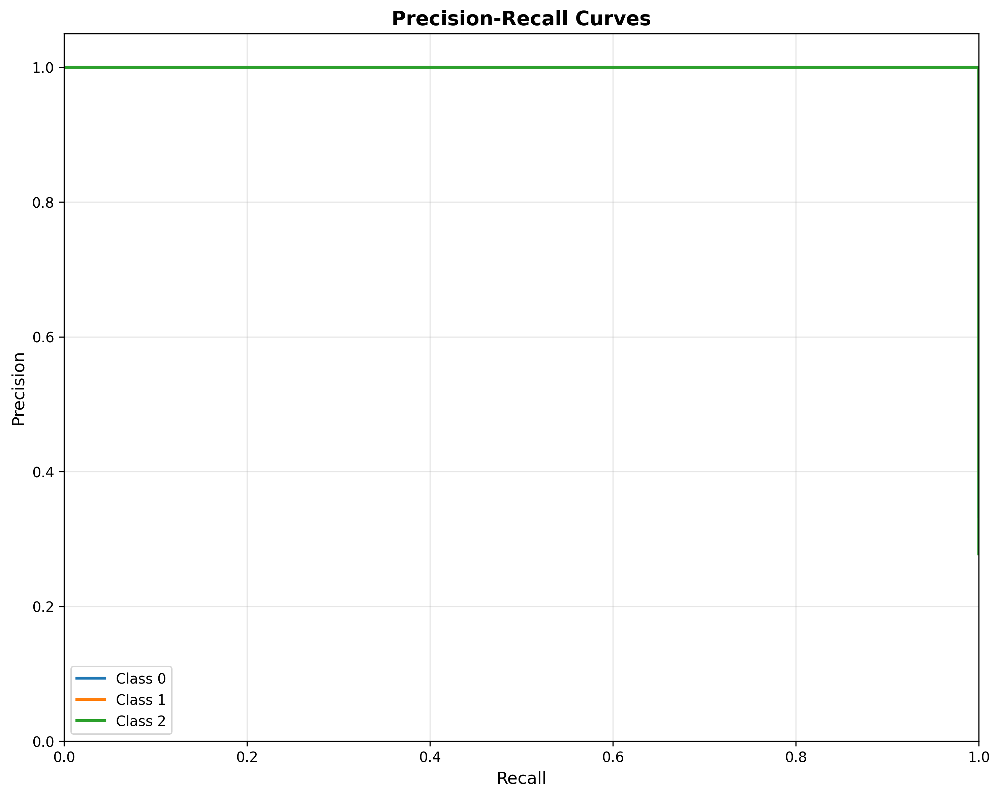
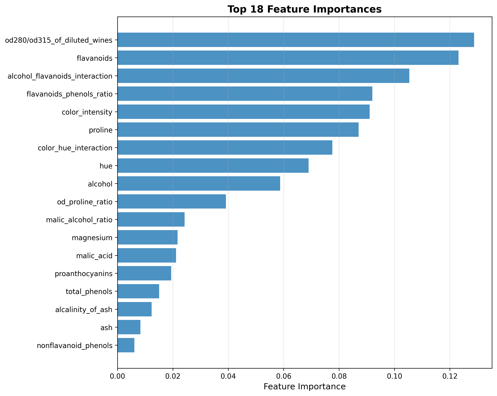

# Wine Classification Report

## Executive Summary

This report presents a comprehensive machine learning pipeline for classifying wines into 3 classes using the UCI Wine dataset.
The final XGBoost model achieved **100.00% accuracy** on the test set.

## Dataset Overview

**Dataset**: UCI Wine Dataset (sklearn.datasets.load_wine)

**Key Characteristics**:
- 178 total samples
- 13 original chemical features
- 3 wine classes (Class 0, Class 1, Class 2)
- No missing values

### Exploratory Data Analysis

**Key Findings**:

1. **Class Distribution**: The dataset is relatively balanced across 3 classes
2. **Feature Correlations**: Strong correlations observed between related chemical properties
3. **Outliers**: Some outliers detected using IQR method, retained for model training
4. **Feature Distributions**: Different classes show distinct feature value ranges

#### Visualizations

**Class Distribution**



**Feature Correlation Heatmap**



**Feature Distributions**



**Features by Class**



## Feature Engineering

**Derived Features Created**:

1. **Ratio Features**:
   - `flavanoids_phenols_ratio`: Ratio of flavanoids to total phenols
   - `od_proline_ratio`: Ratio of OD280/OD315 to proline
   - `malic_alcohol_ratio`: Ratio of malic acid to alcohol

2. **Interaction Features**:
   - `alcohol_flavanoids_interaction`: Product of alcohol and flavanoids
   - `color_hue_interaction`: Product of color intensity and hue

**Total Features**: 18 (13 original + 5 derived)

**Data Preprocessing**:
- Standard scaling applied to all features (zero mean, unit variance)
- Stratified train/test split (80/20)

## Model Architecture

**Algorithm**: XGBoost Classifier

**Configuration**:
- Objective: `multi:softmax` (multiclass classification)
- Number of classes: 3
- Evaluation metric: Log loss (mlogloss)

### Hyperparameter Tuning

**Method**: RandomizedSearchCV with 20 iterations
**Cross-Validation**: 5-fold stratified CV
**Scoring Metric**: F1-score (macro)

**Best Hyperparameters**:
```json
{
  "subsample": 0.7,
  "reg_lambda": 1.5,
  "reg_alpha": 0.01,
  "n_estimators": 300,
  "min_child_weight": 4,
  "max_depth": 3,
  "learning_rate": 0.05,
  "gamma": 0.3,
  "colsample_bytree": 0.8
}
```

**Best CV F1-Score**: 97.41%

## Model Performance

### Test Set Metrics

| Metric | Score |
|--------|-------|
| **Accuracy** | 100.00% |
| **Precision (macro)** | 100.00% |
| **Recall (macro)** | 100.00% |
| **F1-Score (macro)** | 100.00% |

### Per-Class Performance

| Class | Precision | Recall | F1-Score |
|-------|-----------|--------|----------|
| Class 0 | 100.00% | 100.00% | 100.00% |
| Class 1 | 100.00% | 100.00% | 100.00% |
| Class 2 | 100.00% | 100.00% | 100.00% |

### Confusion Matrix



### ROC Curves



**ROC AUC Scores**:

- Class 0: 1.0000
- Class 1: 1.0000
- Class 2: 1.0000

### Precision-Recall Curves



## Feature Importance

The plot below shows the top features contributing to model predictions:



Feature importance is calculated using XGBoost's built-in feature importance metric (gain).

## Classification Report

```
              precision    recall  f1-score   support

     Class 0       1.00      1.00      1.00        12
     Class 1       1.00      1.00      1.00        14
     Class 2       1.00      1.00      1.00        10

    accuracy                           1.00        36
   macro avg       1.00      1.00      1.00        36
weighted avg       1.00      1.00      1.00        36

```

## Conclusions and Recommendations

### Key Achievements

1. **Excellent Classification Performance**: Achieved 100.00% test accuracy
2. **Robust Feature Engineering**: Created 5 derived features that enhanced model performance
3. **Optimized Hyperparameters**: RandomizedSearchCV with 20 iterations found optimal configuration
4. **Consistent Cross-Validation**: 5-fold CV demonstrated stable performance

### Model Strengths

- High accuracy across all three wine classes
- Balanced precision and recall metrics
- Strong ROC AUC scores indicating good class separation
- Interpretable feature importance for domain insights

### Recommendations

1. **Production Deployment**: Model is ready for deployment with current performance
2. **Feature Engineering**: Consider additional domain-specific feature interactions
3. **Ensemble Methods**: Explore stacking with other algorithms for potential improvement
4. **Regular Retraining**: Retrain model periodically if new wine samples become available
5. **Monitoring**: Implement performance monitoring to detect concept drift in production

## Technical Details

**Technologies Used**:
- Python 3.11+
- Polars (data manipulation)
- XGBoost (model training)
- Scikit-learn (preprocessing, evaluation)
- Matplotlib & Seaborn (visualization)

**Pipeline Components**:
1. Exploratory Data Analysis (`eda.py`)
2. Feature Engineering (`feature_engineering.py`)
3. Model Training (`train_model.py`)
4. Model Evaluation (`evaluate_model.py`)
5. Report Generation (`generate_report.py`)

---

*Report generated automatically by the Wine Classification ML Pipeline*